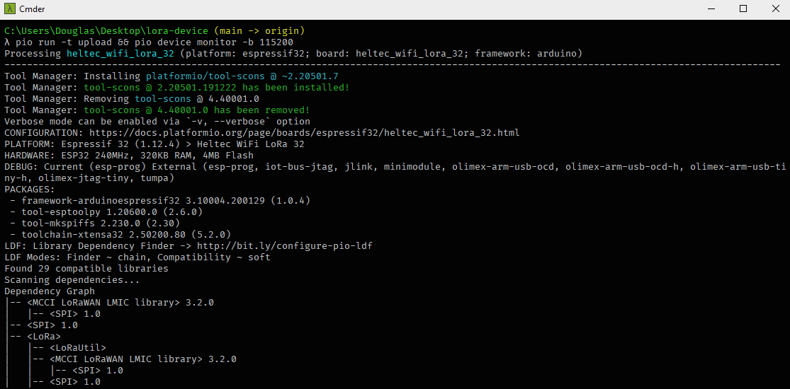
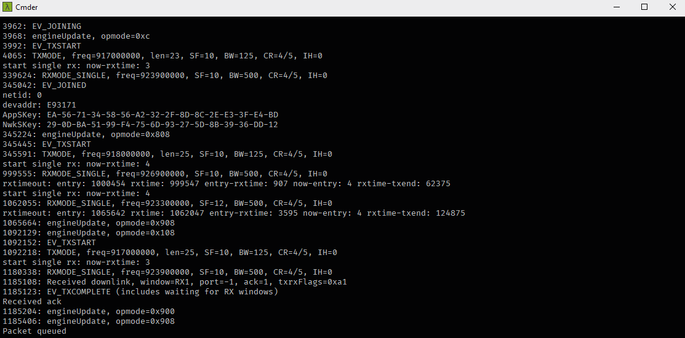

# LoRa Device

[ESP32 Heltec WiFi LoRa 32 (V1)](https://heltec.org/project/wifi-lora-32/) code to work with the [LoRa Server](https://github.com/douglasJovenil/lora-server)

## ☁️ Links
- [LoRa Server](https://github.com/douglasJovenil/lora-server)

## 💻 Project

#### Burning Firmware



#### Serial Output



## 🚀 Technologies

 C++

 PlatformIO

 Python3.7+

## 🏃 Usage

Before you start the server theres some commands that you have to run, just copy and paste one by one the commands bellow:

``` 
git clone https://github.com/douglasJovenil/lora-device
cd lora-device
pio init -b heltec_wifi_lora_32 --ide vscode
pio lib install

cd src
python3.8 setup.py

cd ..
pio run -t upload && pio device monitor -b 115200
```
